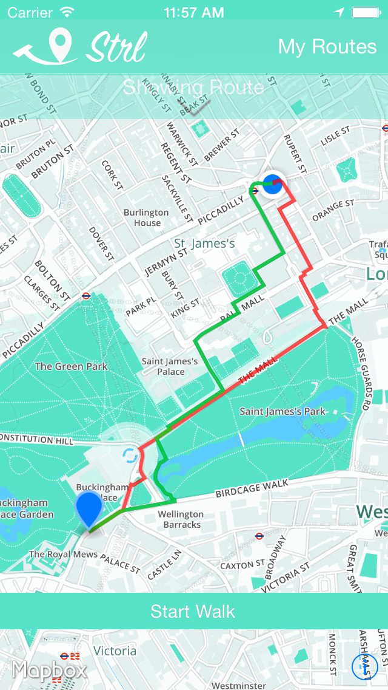

# StrlApp for iOS 

This is the front-end client for the StrlApp routing service for recommending scenic walking detours in London. 

This application uses the [Mapbox iOS SDK](https://github.com/mapbox/mapbox-ios-sdk) with maps being hosted on [Mapbox Hosting](http://mapbox.com/plans/)).

